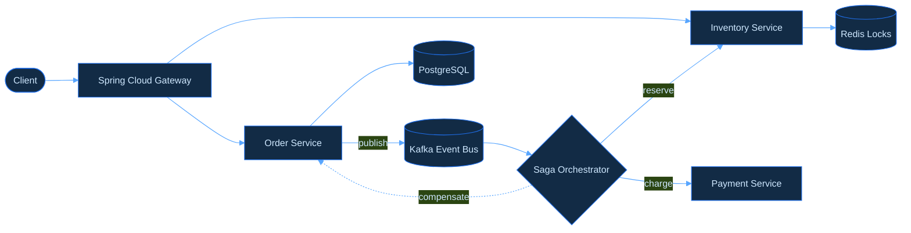
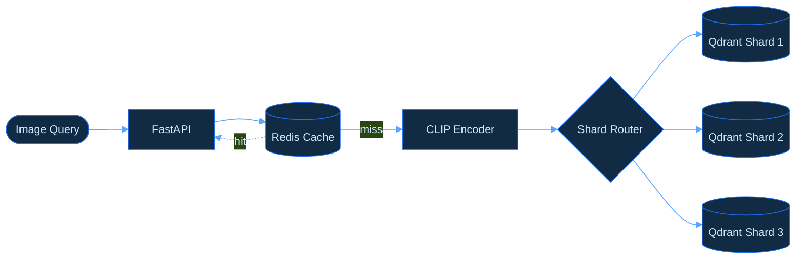
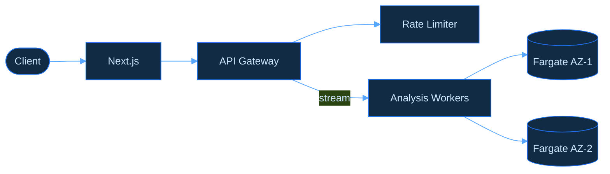

  

  
  
  
  

---

### Tech Stack

**Languages** 

**Infrastructure** 

**Data & ML** 

---

### Featured Work

**Enterprise Retail Platform** — event-driven microservices for multi-store retail.

<b>Details</b>

 

- 6 Spring Boot services with Eureka discovery, Spring Cloud Gateway, and a Kafka event bus
- Saga orchestration for order creation with compensating rollback; 12-state order state machine
- Redis distributed locks (SETNX + Lua atomic unlock) to prevent inventory overselling
- Cache-aside with scheduled warming, JWT auth with 4-tier RBAC

`Java 17` · `Spring Cloud` · `Kafka` · `Redis` · `PostgreSQL` · `Cassandra`

**Image Similarity Search** — distributed vector search at million scale.

<b>Details</b>

 

- End-to-end ML pipeline with CLIP embeddings over a 30K+ image corpus
- 3-shard Qdrant cluster on ECS Fargate with multi-tier Redis caching (85%+ hit rate)
- Sustained throughput under 100+ concurrent users

`Python` · `FastAPI` · `PyTorch` · `Qdrant` · `Redis` · `AWS`

**Code Review Service** — automated code analysis with streaming feedback.

<b>Details</b>

 

- Microservices backend with streaming responses, rate limiting, and 7-language support
- Deployed on ECS Fargate with auto-scaling and multi-AZ redundancy

`TypeScript` · `Next.js` · `FastAPI` · `Terraform` · `AWS`

